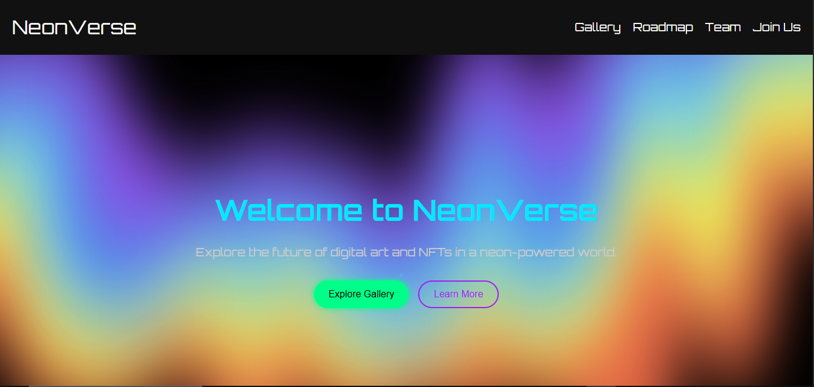

# NeonVerse 🌐✨

**NeonVerse** is a futuristic NFT-themed website prototype that blends stunning visuals, smooth animations, and intuitive user experience into one dynamic landing page. Designed to capture attention with vibrant neon aesthetics and interactivity, this prototype showcases the creative vision of a modern NFT project.

> 🚧 **Note**: This is a prototype of the homepage only. It includes frontend design and interactivity built with HTML, CSS, and JavaScript, but no backend or NFT integration.

---

## ⚡ Project Vision

NeonVerse aims to be more than just a website — it’s a visual universe. The homepage prototype is crafted to represent the energy, artistry, and innovation found in NFT culture, using:

- 🎨 **Neon color palette** (green, blue, pink)
- ✨ **Glowing light effects** and animated elements
- 🚀 A futuristic tone that speaks to digital art and blockchain technology

---

## 🧩 Page Structure

- **Hero Section**  
  Engaging header and animated hero visuals that introduce NeonVerse in style.

- **NFT Gallery**  
  Auto-scrolling slider displaying NFT cards with status indicators like “available” and “sold.”

- **Roadmap Section**  
  A visual timeline of project milestones and future goals, animated on scroll.

- **Team Section**  
  Showcasing the creators and contributors behind NeonVerse.

- **Join Section**  
  A call-to-action area encouraging users to subscribe or join the community.

---

## 🎮 Interactivity & Animation

- ⚙️ **Scroll-triggered animations** (fade-in effects for cards, roadmap steps, and team bios)
- 📱 **Hamburger menu** for fullscreen navigation on mobile
- 🎞️ **Auto-slider** for the NFT showcase
- ✨ Smooth hover and click interactions for an immersive user experience

---

## 💻 Built With

- **HTML5** for structure  
- **CSS3** for styling, gradients, and neon effects  
- **JavaScript** for interactivity (slider, animations, menu)

> No frameworks or libraries used — full control over lightweight and performant code.

---

## 📱 Responsiveness

- Fully responsive across mobile, tablet, and desktop
- Optimized layouts using CSS media queries

---

## 🚀 Goals

This project is built to:

- Present a visually rich **NFT landing page prototype**
- Inspire future development of NFT platforms with engaging UI/UX
- Demonstrate how pure HTML/CSS/JS can deliver modern, polished design

---

## 🌐 Demo

You can go to NeonVerse Demo -> [NeonVerse](https://neonverse-eight.vercel.app/)

## 🧑‍🚀 Author
Created with 💡 and 🔥 by @zEntry6
